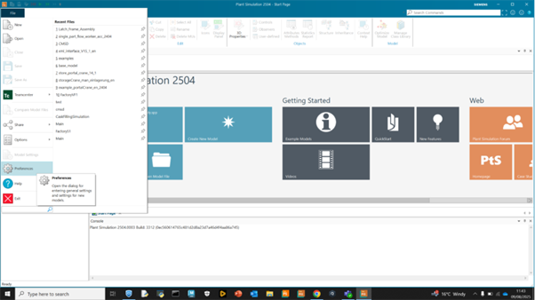
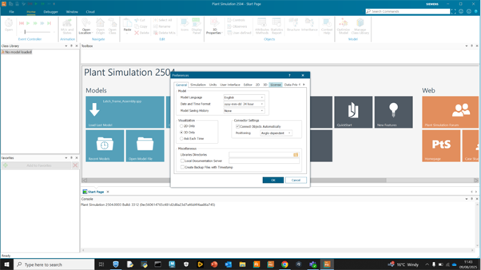

# Plant Simulation Installation Guide

## Siemens Plant Simulation Setup for University of Strathclyde

This guide provides step-by-step instructions for configuring Siemens Plant Simulation with the University of Strathclyde license server.

---

## 📋 Prerequisites

### System Requirements
- **Operating System:** Windows 10/11 (64-bit)
- **RAM:** Minimum 8GB, recommended 16GB
- **Storage:** 10GB free space
- **Network:** Access to University of Strathclyde network
- **Graphics:** DirectX 11 compatible graphics card

### Access Requirements
- Valid University of Strathclyde account
- VPN access (if working remotely)
- Network access to AFRC license server

---

## 🔧 Installation Steps

### Step 1: Software Installation
1. Download Plant Simulation installer from Siemens portal
2. Run installer as Administrator
3. Follow installation wizard with default settings

### Step 2: License Configuration

#### Open Preferences
1. Launch Plant Simulation
2. Navigate to **File** → **Preferences**
3. The preferences window will open



#### Access License Menu
1. In the preferences window, locate the **License** section
2. Click on **License** to expand the menu options



#### Configure License Settings
1. In the License configuration panel, click **Setup License**
2. This will open the license configuration dialogue


#### Set License Parameters
Configure the following settings exactly as specified:

**License Type:**
- Set to **Highest Available**
- This ensures access to all licensed features

**Server Configuration:**
- **Server:** `afrc-ls4.afrc.strath.ac.uk`
- **Port:** `28000`

**Configuration Details:**
```
License Server: afrc-ls4.afrc.strath.ac.uk
Port Number: 28000
License Type: Highest Available
Connection Type: Network License
```

#### Apply Configuration
1. Click **Apply** to save the license settings
2. **Restart Plant Simulation** for changes to take effect
3. The software will now connect to the University license server

---

## ✅ Verification Steps

### Check License Status
After restart, verify the license configuration:

1. **File** → **Help** → **About Plant Simulation**
2. Check that license shows as "Network License" 
3. Verify connection to `afrc-ls4.afrc.strath.ac.uk:28000`
4. Confirm available features match your access level

### Test Basic Functionality
1. Create a new model: **File** → **New**
2. Insert a basic object (e.g., Source, Server, Drain)
3. Run a simple simulation to confirm functionality
4. Save the test model to verify write permissions

---

## 🔧 Troubleshooting

### Common Issues

#### License Server Connection Failed
**Symptoms:** Error message about license server unavailable
**Solutions:**
- Verify University network connection or VPN
- Check firewall settings allow port 28000
- Confirm server address: `afrc-ls4.afrc.strath.ac.uk`
- Contact IT support if connection issues persist

#### License Not Available
**Symptoms:** "No license available" error
**Solutions:**
- Check if maximum concurrent users reached
- Try again during off-peak hours
- Verify your account has Plant Simulation access
- Contact Digital Factory team for license allocation

#### Performance Issues
**Symptoms:** Slow startup or operation
**Solutions:**
- Ensure minimum system requirements met
- Close unnecessary applications
- Check available disk space
- Consider upgrading RAM if consistently slow

### Network Configuration

#### For Remote Access (VPN Required)
1. Connect to University VPN first
2. Then launch Plant Simulation
3. License server accessible only through University network

#### For On-Campus Use
- Direct network connection to license server
- No additional configuration required
- Ensure connected to University WiFi/Ethernet

---
